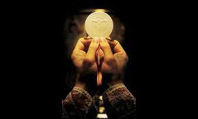
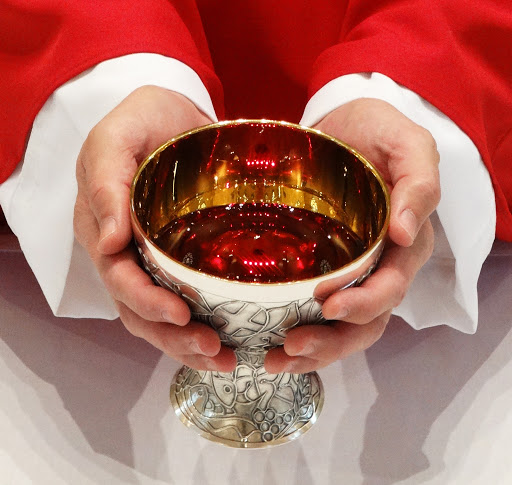

   
## Offering of the Host ##
Accept, O holy Father, almighty and eternal God, this unspotted host, which I, Thy unworthy servant, offer unto Thee, my living and true God, for my innumerable sins, offenses, and negligences, and for all here present: as also for all faithful Christians, both living and dead, that it may avail both me and them for salvation unto life everlasting. Amen.

## Offering of the Chalice ##
We offer unto Thee, O Lord, the chalice of salvation, beseeching Thy clemency, that it may ascend before Thy divine Majesty, as a sweet savor, for our salvation, and for that of the whole world. Amen.

## The Consecration ##
“For this is my Body.”
   

“For this is the chalice of my Blood of the new and eternal testament, the mystery of faith; which shall be shed for you and for many unto the remission of sins.”
   

## Domine, Non Sum Dignus ##
Lord, I am not worthy that Thou shouldst enter under my roof; say but the word, and my soul shall be healed.
   

## The Communion Prayers ##
The Body of our Lord Jesus Christ preserve my soul unto life everlasting. Amen.
   

The Blood of our Lord Jesus Christ preserve my soul unto life everlasting. Amen.
   

   
  
