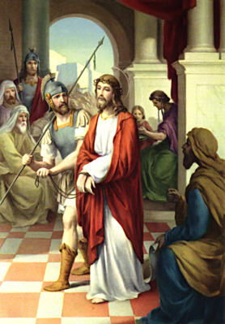

## OPENING PRAYER ##

V: 	We adore you O Christ and we bless you  
**R:	Because by your holy cross you have redeemed the world.**

### Let us pray ###

God our Father, in obedience to you, your only Son accepted death on the cross for the salvation of mankind. We acknowledge the mystery of the cross on earth. May we receive the gift of redemption in heaven. We ask this through Christ our Lord. Amen.

V. 	Have mercy on us, O Lord!  
**R. 	Have mercy on us!**

**Hymn:**  
At the cross her station keeping  
Stood the mournful mother weeping.  
Close to Jesus to the last.

   

## FIRST STATION ##
JESUS IS CONDEMNED TO DEATH  
  

V: 	We adore you O Christ and we bless you  
**R:	Because by your holy cross you have redeemed the world.**  

### From the Gospel of St. John ###
Pilate was anxious to set him free, but the Jews shouted, “If you set him free you are no friend of Caesar’s; anyone who makes himself king is defying Caesar”. Hearing these words, Pilate had Jesus brought out. “Here is your king” he said to the Jews. “Take him away, take him away!” they said, “Crucify him!” “Do you want me to crucify your king?” said Pilate. The chief priest answered, “We have no king except Caesar”. So in the end, Pilate handed him over to them to be crucified. (Jn. 19: 12 - 13a; 15-16)

### Words of Our Lord ###
“The Father loves me, because I lay down my life in order to take it up again. No one takes it from me; I lay it down of my own free will, and as it is in my power to lay it down, so it is in my power to take it up again; and this is the command I have been given by my Father”. (Jn. 10: 17 - 18)

### Let us pray ###
Lord, by shedding His blood for us, Your Son, Jesus Christ, established the paschal mystery. In Your goodness, make us holy and watch over us always. We ask this through the same Christ our Lord. Amen.  

V. 	Have mercy on us, O Lord!  
**R. 	Have mercy on us!**

**Hymn:**  
Through her heart his sorrow sharing,  
All his bitter anguish bearing,  
Now, at length, the sword has passed.

   
