## [OPENING PRAYER](#opening) ##
Kneeling before the altar, make an act of Contrition, and form the intention of gaining the indulgences, whether for yourself or for the souls in Purgatory. 

Then say: 

My Lord Jesus Christ, Thou hast made this journey to die for me with love unutterable, and I have so many times unworthily abandoned Thee; but now I love Thee with my whole heart, and because I love Thee, I repent sincerely for ever having offended Thee. Pardon me, my God, and permit me to accompany Thee on this journey. Thou goest to die for love of me; I wish also, my beloved Redeemer, to die for love of Thee. My Jesus, I will live and die always united to Thee.

## [FIRST STATION](#first-station) ##

JESUS IS CONDEMNED TO DEATH  
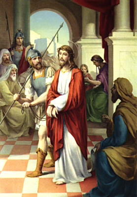   

V. We adore Thee, O Christ, and we praise Thee. 
R. Because by Thy holy Cross, Thou hast redeemed the world.

Consider that Jesus, after having been scourged and crowned with thorns, was unjustly condemned by Pilate to die on the Cross.

My adorable Jesus, it was not Pilate. No, it was my sins that condemned Thee to die. I beseech Thee, by the merits of this sorrowful journey, to assist my soul in its journey towards eternity. 

I love Thee, my beloved Jesus; I love Thee more than myself; I repent with my whole heart for having offended Thee. Never permit me to separate myself from Thee again. Grant that I may love Thee always; and then do with me what Thou wilt.

Our Father, Hail Mary, Glory be to the Father.

Lord Jesus Crucified, have mercy on us. 

[Stabat Mater dolorosa, Juxta crucem lacrymosa, Dum pendebat Filius.\
At the cross her station keeping; Stood the mournful Mother weeping; Close to Jesus to the last](#second-station).
   

## [SECOND STATION](#second-station) ##

JESUS IS MADE TO CARRY HIS CROSS   
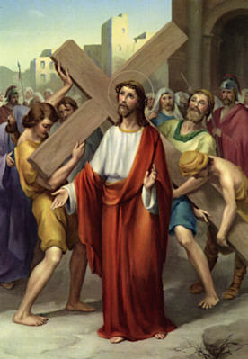   

V. We adore Thee, O Christ, and we praise Thee. 
R. Because by Thy holy Cross, Thou hast redeemed the world.

Consider that Jesus in making this journey with the Cross on His shoulders thought of us and offered to His Father, for us, the death He was about to undergo.

My most beloved Jesus, I embrace all the tribulations Thou hast destined for me until death. I beseech Thee, by the merits of the pain Thou didst suffer in carrying Thy Cross, to give me the necessary help to carry mine with perfect patience and resignation. 

I love Thee, Jesus my love; I repent of having offended Thee. Never permit me to separate myself from Thee again. Grant that I may love Thee always; and then do with me what Thou wilt.

Our Father, Hail Mary, Glory be to the Father.

Lord Jesus Crucified, have mercy on us.

[Cujus animam gementem, Contristatam et dolentem, Per transivit gladius.\
Through her heart, his sorrow sharing, All his bitter anguish bearing, Now at length the sword has passed.](#third-station)
   

## [THIRD STATION](#third-station) ##

JESUS FALLS THE FIRST TIME   
   
V. We adore Thee, O Christ, and we praise Thee. 
R. Because by Thy holy Cross, Thou hast redeemed the world.

Consider this first fall of Jesus under His Cross. His flesh was torn by the scourges, His head crowned with thorns, and He had lost a great quantity of blood. He was so weakened that he could scarcely walk, and yet he had to carry this great load upon His shoulders. The soldiers struck Him rudely, and thus He fell several times in His journey.

My beloved Jesus, it is not the weight of the cross, but of my sins, which have made Thee suffer so much pain. Ah, by the merits of this first fall, deliver me from the misfortune of falling into mortal sin.

I love Thee, O my Jesus, with my whole heart; I repent of having offended Thee. Never permit me to offend Thee again. Grant that I may love Thee always; and then do with me what Thou wilt.

Our Father, Hail Mary, Glory be to the Father.

Lord Jesus Crucified, have mercy on us.

[O quam tristis et afflicta; Fuit illa benedicta; Mater Unigeniti!\
O, how sad and sore distressed; Was that Mother highly blessed; Of the sole Begotten One!](#fourth-station)
   

## [FOURTH STATION](#fourth-station) ##

JESUS MEETS HIS SORROWFUL MOTHER   
   

V. We adore Thee, O Christ, and we praise Thee. 
R. Because by Thy holy Cross, Thou hast redeemed the world.

Consider the meeting of the Son and the Mother which took place on this journey. Jesus and Mary looked at each other, and their looks became as so many arrows to wound those hearts which loved each other so tenderly.

My most loving Jesus, by the sorrow Thou didst experience in this meeting, grant me the grace of a truly devoted love for Thy most holy Mother. And thou, my Queen, who wast overwhelmed with sorrow, obtain for me by thy intercession a continual and tender remembrance of the Passion of thy Son. 

I love Thee, Jesus my love; I repent of ever having offended Thee. Never permit me to offend Thee again. Grant that I may love Thee always; and then do with me what Thou wilt.

Our Father, Hail Mary, Glory be to the Father.

Lord Jesus Crucified, have mercy on us.

[Quae moerebat, et dolebat, Pia Mater dum videbat Nati poenas inclyti.\
Christ above in torment hangs, She beneath beholds the pangs, Of her dying, glorious Son.](#fifth-station)
   

## [FIFTH STATION](#fifth-station) ##

SIMON THE CYRENIAN HELPS JESUS TO CARRY HIS CROSS  
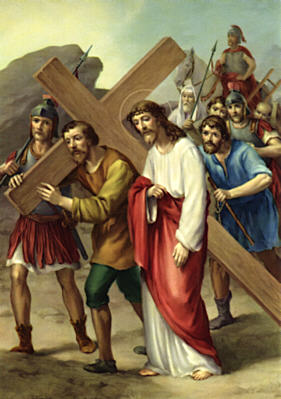   

V. We adore Thee, O Christ, and we praise Thee. 
R. Because by Thy holy Cross, Thou hast redeemed the world.

Consider that the Jews seeing that at each step Jesus from weakness was on the point of expiring and fearing that He would die on the way when they wished Him to die the ignominious death of the Cross constrained Simon the Cyrenian to carry the Cross behind our Lord.

My most sweet Jesus, I will not refuse the Cross, as the Cyrenian did; I accept it; I embrace it. I accept in particular the death Thou hast destined for me; with all the pains that may accompany it; I unite it to Thy death, I offer it to Thee. Thou hast died for love of me; I will die for love of Thee, and to please Thee. Help me by Thy grace. 

I love Thee, Jesus my love; I repent of having offended Thee. Never permit me to offend Thee again. Grant that I may love Thee always; and then do with me what Thou wilt.

Our Father, Hail Mary, Glory be to the Father.

Lord Jesus Crucified, have mercy on us.

[Quis est homo qui non fleret; Matrem Christi si videret; In tanto supplicio?\
Is there one who would not weep, ‘whelmed in miseries so deep Christ’s dear Mother to behold?](#sixth-station)
   

## [SIXTH STATION](#sixth-station) ##

VERONICA WIPES THE FACE OF JESUS  
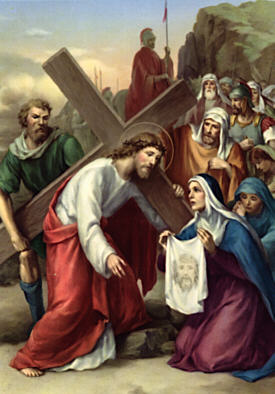   

V. We adore Thee, O Christ, and we praise Thee. 
R. Because by Thy holy Cross, Thou hast redeemed the world.

Consider that the holy woman named Veronica seeing Jesus so afflicted and His face bathed in sweat and blood presented Him with a towel with which He wiped His adorable face leaving on it the impression of His holy countenance.

My most beloved Jesus, Thy face was beautiful before, but in this journey it has lost all its beauty, and wounds and blood have disfigured it. Alas! my soul also was once beautiful, when it received Thy grace in Baptism; but I have disfigured it since by my sins; Thou alone, my Redeemer, canst restore it to its former beauty. Do this by Thy Passion, O Jesus. 

I repent of having offended Thee. Never permit me to offend Thee again. Grant that I may love Thee always; and then do with me what Thou wilt.

Our Father, Hail Mary, Glory be to the Father.

Lord Jesus Crucified, have mercy on us.

[Quis non posset contristari, Christi Matrem contemplari, Dolentem cum Filio?\
Can the human heart refrain, From partaking in her pain, In that Mother’s pain untold?](#seventh-station)
   

## [SEVENTH STATION](#seventh-station) ##

JESUS FALLS THE SECOND TIME  
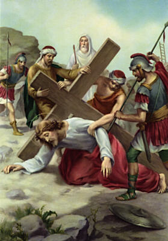   

V. We adore Thee, O Christ, and we praise Thee. 
R. Because by Thy holy Cross, Thou hast redeemed the world.

Consider the second fall of Jesus under the Cross -- a fall which renews the pain of all the wounds of the head and members of our afflicted Lord.

My most gentle Jesus, how many times Thou hast pardoned me, and how many times have I fallen again, and begun again to offend Thee! Oh, by the merits of this new fall, give me the necessary help to persevere in Thy grace until death. Grant that in all temptations which assail me I may always commend myself to Thee.

 I love Thee, Jesus, my love, with my whole heart; I repent of having offended Thee. Never permit me to offend Thee again. Grant that I may love Thee always; and then do with me what Thou wilt.
 
Our Father, Hail Mary, Glory be to the Father.

Lord Jesus Crucified, have mercy on us.

[Pro peccatis suae gentis, Vidit Jesum in tormentis, Et flagellis subditum,\
Bruised, derided, cursed, defiled; She beheld her tender Child; All with bloody scourges rent,](#eight-station)
   

## [EIGHT STATION](#eight-station) ##

THE WOMEN OF JERUSALEM WEEP OVER JESUS   
   

V. We adore Thee, O Christ, and we praise Thee. 
R. Because by Thy holy Cross, Thou hast redeemed the world.

Consider that those women wept with compassion at seeing Jesus in such a pitiable state, streaming with blood as He walked along. But Jesus said to them: Weep not for Me, but for your children.

My Jesus, laden with sorrows, I weep for the offences I have committed against Thee, because of the pains which they have deserved, and still more because of the displeasure they have caused Thee, who hast loved me so much. It is Thy love, more than the fear of hell, which causes me to weep for my sins. 

My Jesus, I love Thee more than myself; I repent of having offended Thee. Never permit me to offend Thee again. Grant that I may love Thee always; and then do with me what Thou wilt.

Our Father, Hail Mary, Glory be to the Father.

Lord Jesus Crucified, have mercy on us.	

[Vidit suum dulcem natum, Moriendo, desolatum, Dum emisit spiritum.\
For the sins of his own nation; Saw him hang in desolation; Till his spirit forth he sent.](#ninth-station)
   

## [NINTH STATION](#ninth-station) ##

JESUS FALLS THE THIRD TIME  
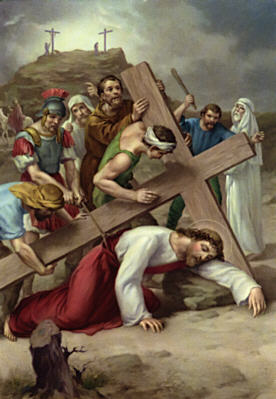   

V. We adore Thee, O Christ, and we praise Thee. 
R. Because by Thy holy Cross, Thou hast redeemed the world.

Consider the third fall of Jesus Christ. His weakness was extreme, and the cruelty of His executioners was excessive, who tried to hasten His steps when He had scarcely strength to move.

Ah, my outraged Jesus, by the merits of the weakness Thou didst suffer in going to Calvary, give me strength sufficient to conquer all human respect, and all my wicked passions, which have led me to despise Thy friendship. 

I love Thee, Jesus my love, with my whole heart; I repent of having offended Thee. Never permit me to offend Thee again. Grant that I may love Thee always; and then do with me what Thou wilt.

Our Father, Hail Mary, Glory be to the Father.

Lord Jesus Crucified, have mercy on us.

[Eia Mater, fons amoris, Me sentire vim doloris. Fac, ut tecum lugeam.\
O thou Mother! fount of Love, Touch my spirit from above. Make my heart with thine accord:
](#tenth-station)
   

## [TENTH STATION](#tenth-station) ##

JESUS IS STRIPPED OF HIS GARMENTS  
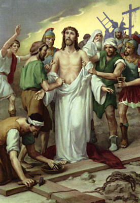   

V. We adore Thee, O Christ, and we praise Thee. 
R. Because by Thy holy Cross, Thou hast redeemed the world.

Consider the violence with which the executioners stripped Jesus. His inner garments adhered to His torn flesh, and they dragged them off so roughly that the skin came with them. Compassionate your Saviour thus cruelly treated, and say to Him:

My innocent Jesus, by the merits of the torment Thou hast felt, help me to strip myself of all affection to things of earth, in order that I may place all my love in Thee, who art so worthy of my love. 

I love Thee, O Jesus, with my whole heart; I repent of having offended Thee. Never permit me to offend Thee again. Grant that I may love Thee always; and then do with me what Thou wilt.

Our Father, Hail Mary, Glory be to the Father.

Lord Jesus Crucified, have mercy on us.

[Fac, ut ardeat cor meum, In amando Christum Deum, Ut sibi complaceam.\
Make me feel as Thou hast felt; Make my soul to glow and melt; With the love of Christ, my Lord.
](#eleventh-station)
   

## [ELEVENTH STATION](#eleventh-station) ##

JESUS IS NAILED TO THE CROSS   
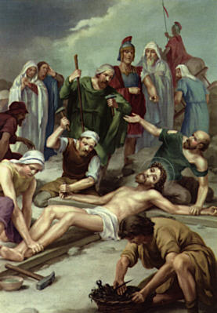   

V. We adore Thee, O Christ, and we praise Thee. 
R. Because by Thy holy Cross, Thou hast redeemed the world.

Consider that Jesus after being thrown on the cross extended His hands and offered to His eternal Father the sacrifice of His life for our salvation. These barbarians fastened Him with nails and then, raising the cross, left Him to die with anguish on this infamous gibbet. 

My Jesus! loaded with contempt, nail my heart to Thy feet, that it may ever remain there, to love Thee, and never quit Thee again. 

I love Thee more than myself; I repent of having offended Thee. Never permit me to offend Thee again. Grant that I may love Thee always; and then do with me what Thou wilt.

Our Father, Hail Mary, Glory be to the Father.

Lord Jesus Crucified, have mercy on us.

[Sancta Mater istud agas, Crucifixi fige plagas Cordi meo valide.\
Holy Mother, pierce me through! In my heart each wound renew; Of my Savior crucified](#twelfth-station)
   

## [TWELFTH STATION](#twelfth-station) ##

JESUS IS RAISED UPON THE CROSS AND DIES  
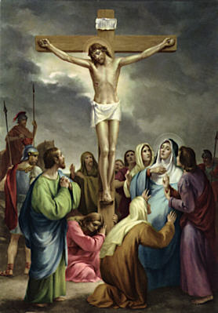   

V. We adore Thee, O Christ, and we praise Thee. 
R. Because by Thy holy Cross, Thou hast redeemed the world.

Consider how thy Jesus, after three hours of Agony on the Cross, consumed at length with anguish, abandons Himself to the weight of His body, bows His head, and dies.

O my dying Jesus, I kiss devoutly the Cross on which Thou didst die for love of me. I have merited by my sins to die a miserable death; but Thy death is my hope. Ah, by the merits of Thy death, give me grace to die, embracing Thy feet, and burning with love for Thee. I commit my soul into Thy hands. 

I love Thee with my whole heart; I repent of ever having offended Thee. Never permit me to offend Thee again. Grant that I may love Thee always; and then do with me what Thou wilt.

Our Father, Hail Mary, Glory be to the Father.

Lord Jesus Crucified, have mercy on us.

[Tui nati vulnerati, Tam dignati pro me pati, Poenas mecum divide.\
Let me share with thee His pain, Who for all our sins was slain. Who for me in torments died.](#thirteenth-station)
   
 
 
## [THIRTEENTH STATION](#thirteenth-station) ##

JESUS IS TAKEN DOWN FROM THE CROSS AND PLACED IN THE ARMS OF HIS MOTHER   
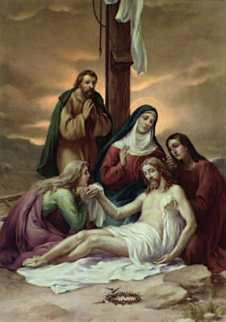   

V. We adore Thee, O Christ, and we praise Thee. 
R. Because by Thy holy Cross, Thou hast redeemed the world.

Consider that our Lord having expired, two of His disciples, Joseph and Nicodemus, took Him down from the cross and placed Him in the arms of His afflicted Mother, who received Him with unutterable tenderness and pressed Him to her bosom.

O Mother of sorrow, for the love of this Son, accept me for thy servant, and pray to Him for me. And Thou, my Redeemer, since Thou hast died for me, permit me to love Thee; for I wish but Thee, my Jesus, and I repent of ever having offended Thee. Never permit me to offend Thee again. Grant that I may love Thee always; and then do with me what Thou wilt.

Our Father, Hail Mary, Glory be to the Father.

Lord Jesus Crucified, have mercy on us.

[Fac me tecum pie flere, Crucifixo condolere, Donec ego vixero.\
Let me mingle tears with thee, Mourning him who mourned for me All the days that I may live](#fourteenth-station)
   

## [FOURTEENTH STATION](#fourteenth-station) ##

JESUS IS PLACED IN THE SEPULCHRE   
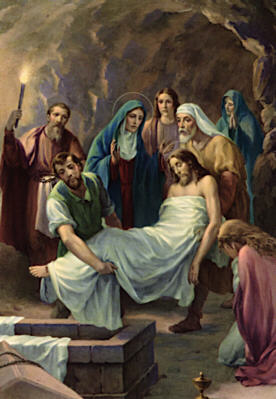   

V. We adore Thee, O Christ, and we praise Thee. 
R. Because by Thy holy Cross, Thou hast redeemed the world.

Consider that the disciples carried the body of Jesus to bury it, accompanied by His holy Mother, who arranged it in the sepulchre with her own hands. They then closed the tomb and all withdrew. 

Oh, my buried Jesus, I kiss the stone that encloses Thee. But Thou didst rise again the third day. I beseech Thee, by Thy resurrection, make me rise glorious with Thee at the last day, to be always united with Thee in heaven, to praise Thee and love Thee forever. 

I love Thee, and I repent of ever having offended Thee. Never permit me to offend Thee again. Grant that I may love Thee always; and then do with me what Thou wilt.

Our Father, Hail Mary, Glory be to the Father.

Lord Jesus Crucified, have mercy on us.

[Juxta crucem tecum stare, Et me tibi sociare, In planctu desidero\
By the cross with you to stay, There with you to weep and pray, Is all I ask of Thee to give.
](#closing)
   

Virgo virginum praeclara,\
mihi iam non sis amara,\
fac me tecum plangere.\
   

Fac, ut portem Christi mortem,\
passionis fac consortem,\
et plagas recolere.\
   

Fac me plagis vulnerari,\
fac me Cruce inebriari,\
et cruore Filii.\
   

Flammis ne urar succensus,\
per te, Virgo, sim defensus\
in die iudicii. \
   

Christe, cum sit hinc exire,\
da per Matrem me venire\
ad palmam victoriae. \
   

Quando corpus morietur,\
fac, ut animae donetur\
paradisi gloria. Amen. \
   

## [CLOSING](#closing) ##

Our Father, Hail Mary, Glory be to the Father.

## [Prayer to Jesus Crucified](#JesusCrucified) ##
  

Behold, O kind and most sweet Jesus, I cast myself upon my knees in Thy sight, and with the most fervent desire of my soul, I pray and beseech Thee that Thou wouldst impress upon my heart lively sentiments of faith, hope, and charity, with true contrition for my sins and a firm purpose of amendment; while with deep affection and grief of soul, I ponder within myself and mentally contemplate Thy five wounds, having before my eyes the words which David the prophet put on Thy lips concerning Thee: “They have pierced my hands and my feet, they have numbered all my bones.”

[+](#opening)

      

