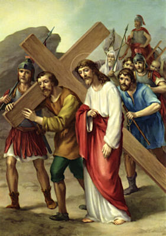
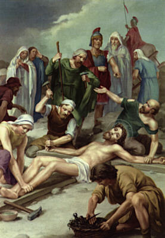
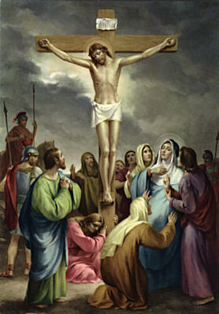

## [FIRST STATION](#first-station) ##

JESUS IS CONDEMNED TO DEATH  
   

[O Jesus! so meek and uncomplaining, teach me resignation in trials.](#second-station).
   

## [SECOND STATION](#second-station) ##

JESUS RECEIVES THE CROSS   
   

[My Jesus, this Cross should be mine, not Thine; my sins crucified Thee.](#third-station).
   

## [THIRD STATION](#third-station) ##

JESUS FALLS THE FIRST TIME UNDER HIS CROSS   
   

[O Jesus! by this first fall, never let me fall into mortal sin.](#fourth-station)
   

## [FOURTH STATION](#fourth-station) ##

JESUS IS MET BY HIS BLESSED MOTHER   
   

[O Jesus! may no human tie, however dear, keep me from following the road of the Cross.](#fifth-station)
   

## [FIFTH STATION](#fifth-station) ##

THE CROSS IS LAID UPON SIMON OF CYRENE   
   

[Simon unwillingly assisted Thee; may I with patience suffer all for Thee.](#sixth-station)
   

## [SIXTH STATION](#sixth-station) ##

VERONICA WIPES THE FACE OF JESUS  
   

[O Jesus! Thou didst imprint Thy sacred features upon Veronica's veil; stamp them also indelibly upon my heart.](#seventh-station)
   

## [SEVENTH STATION](#seventh-station) ##

JESUS FALLS THE SECOND TIME  
   

[By Thy second fall, preserve me, dear Lord, from relapse into sin](#eight-station)
   

## [EIGHT STATION](#eight-station) ##

THE WOMEN OF JERUSALEM MOURN FOR OUR LORD   
   

[My greatest consolation would be to hear Thee say:  "Many sins are forgiven thee, because thou hast loved much."](#ninth-station)
   

## [NINTH STATION](#ninth-station) ##

JESUS FALLS FOR THE THIRD TIME  
   

[O Jesus!  when weary upon life's long journey, be Thou my strength and my perseverance.](#tenth-station)
   

## [TENTH STATION](#tenth-station) ##

JESUS IS STRIPPED OF HIS GARMENTS  
   

[My soul has been robbed of its robe of innocence; clothe me, dear Jesus, with the garb of penance and contrition.](#eleventh-station)
   

## [ELEVENTH STATION](#eleventh-station) ##

JESUS IS NAILED TO THE CROSS   
   

[Thou didst forgive Thy enemies; my God, teach me to forgive injuries and FORGET them.](#twelfth-station)
   

## [TWELFTH STATION](#twelfth-station) ##

JESUS DIES ON THE CROSS   
   

[Thou art dying, my Jesus, but Thy Sacred Heart still throbs with love for Thy sinful children.](#thirteenth-station)
   
 
 
## [THIRTEENTH STATION](#thirteenth-station) ##

JESUS IS TAKEN DOWN FROM THE CROSS     
   

[Receive me into thy arms, O Sorrowful Mother; and obtain for me perfect contrition for my sins.](#fourteenth-station)

   

## [FOURTEENTH STATION](#fourteenth-station) ##

JESUS IS PLACED IN THE SEPULCHRE   
   

[When I receive Thee into my heart in Holy Communion, O Jesus, make it a fit abiding place for Thy adorable Body. Amen.](#first-station)
   

      

