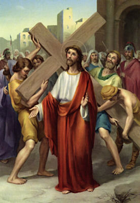

## OPENING PRAYER ##

V: 	We adore you O Christ and we bless you  
**R:	Because by your holy cross you have redeemed the world.**

### Let us pray ###

God our Father, in obedience to you, your only Son accepted death on the cross for the salvation of mankind. We acknowledge the mystery of the cross on earth. May we receive the gift of redemption in heaven. We ask this through Christ our Lord. Amen.

V. 	Have mercy on us, O Lord!  
**R. 	Have mercy on us!**

**Hymn:**  
At the cross her station keeping  
Stood the mournful mother weeping.  
Close to Jesus to the last.

   

## FIRST STATION ##

JESUS IS CONDEMNED TO DEATH  
   

V: 	We adore you O Christ and we bless you  
**R:	Because by your holy cross you have redeemed the world.**  

### From the Gospel of St. John ###
Pilate was anxious to set him free, but the Jews shouted, “If you set him free you are no friend of Caesar’s; anyone who makes himself king is defying Caesar”. Hearing these words, Pilate had Jesus brought out. “Here is your king” he said to the Jews. “Take him away, take him away!” they said, “Crucify him!” “Do you want me to crucify your king?” said Pilate. The chief priest answered, “We have no king except Caesar”. So in the end, Pilate handed him over to them to be crucified. (Jn. 19: 12 - 13a; 15-16)

### Words of Our Lord ###
“The Father loves me, because I lay down my life in order to take it up again. No one takes it from me; I lay it down of my own free will, and as it is in my power to lay it down, so it is in my power to take it up again; and this is the command I have been given by my Father”. (Jn. 10: 17 - 18)

### Let us pray ###
Lord, by shedding His blood for us, Your Son, Jesus Christ, established the paschal mystery. In Your goodness, make us holy and watch over us always. We ask this through the same Christ our Lord. Amen.  

V. 	Have mercy on us, O Lord!  
**R. 	Have mercy on us!**

 

**Hymn:**  
Through her heart his sorrow sharing,  
All his bitter anguish bearing,  
Now, at length, the sword has passed.

   

## SECOND STATION ##

JESUS RECEIVES THE CROSS   
   

V: 	We adore you O Christ and we bless you  
**R:	Because by your holy cross you have redeemed the world.**  

### From the Gospel of St. John ###
They then took charge of Jesus, and carrying His own cross He went out of the city to the place of the skull or as it was called in Hebrew, Golgotha. (Jn. 19:17)

### Words of Our Lord ###
“If anyone wants to be a follower of mine, let him renounce himself and take up his cross and follow me. For anyone who wants to save his life will lose it; but anyone who loses his life for my sake will find it. What then, will a man gain if he wins the whole world and ruins his life? Or what has a man to offer in exchange for his life?” (Mt. 16: 24 - 26)

### Let us pray ###
Almighty and ever-living God, You gave our Saviour the command to undergo the cross, as an example for all men to follow. We have the lessons of His suffering, give us also the fellowship of His resurrection. We ask this through Christ our Lord. Amen

V. 	Have mercy on us, O Lord!  
**R. 	Have mercy on us!**

 

**Hymn:**   
O how sad and sore distressed  
was that Mother; highly blessed,      
Of the Sole-Begotten One.

   

## THIRD STATION ##

JESUS FALLS THE FIRST TIME UNDER HIS CROSS   
   

V: 	We adore you O Christ and we bless you  
**R:	Because by your holy cross you have redeemed the world.**  

### From the Prophet Isaiah ###
The Lord Yahweh has opened my ear. For my part, I made no resistance neither did I turn away. I offered my back to those who struck me, my cheeks to those who tore at my beard; l did not cover my face against insult and spittle. The Lord Yahweh comes to my help, so that I am untouched by the insults. So, too, I set my face like flint; I know I shall not be shamed. (Is. 50:5 - 7)

### Words of Our Lord ###
“I tell you, most solemnly, unless a wheat grain falls on the ground and dies, it remains only a single grain; but if it dies, it yields a rich harvest. Anyone who loves his life loses it; anyone who hates his life in this world will keep it for the eternal life. Now my soul is troubled. What shall I say: Father, save me from this hour? But it was for this very reason that I have come to this hour. Father glorify your name!” (Jn. 12: 24 - 25; 27 - 28)

### Let us pray ###
Father, through the obedience of Jesus, your servant and your Son, you raised a fallen world. Free us from sin and bring us to the joy that lasts forever. We ask this through Christ our Lord. Amen.

V. 	Have mercy on us, O Lord!  
**R. 	Have mercy on us!**

 

**Hymn:**   
Christ above in torment hangs;  
She beneath beholds the pangs  
Of her dying glorious Son  

   

### FOURTH STATION ###

JESUS IS MET BY HIS BLESSED MOTHER   
   

V: 	We adore you O Christ and we bless you  
**R:	Because by your holy cross you have redeemed the world.**  

### From the Gospel of St. Luke ###
Simeon blessed them and said to Mary his mother, “You see this child, He is destined for the fall and for the rising of many in Israel, destined to be a sign that is rejected - and a sword will pierce your own soul too - so that the secret thoughts of many may be laid bare”. (Lk. 2: 34 - 35)

### Words of Our Lord ###
“I have come so that they may have life and have it to the full. I am the good shepherd; I know my own and my own know me, just as the Father knows me and I know the Father; and I lay down my life for my sheep”. (Jn. 10; 10b; 14 - 15)

### Let us pray ###
Father, you prepared the Virgin Mary to be a worthy mother of your Son. You let her share beforehand in the salvation Christ would bring by his death and kept her sinless from the first moment of her being. Help us by her prayers to live in your presence without sin. We ask this through Christ our Lord. Amen

V. 	Have mercy on us, O Lord!  
**R. 	Have mercy on us!**

 

**Hymn:**   
Is there one who would not weep,  
Whelmed in miseries so deep,  
Christ’s dear mother to behold?

   
### FIFTH STATION ###

THE CROSS IS LAID UPON SIMON OF CYRENE   
   

V: 	We adore you O Christ and we bless you  
**R:	Because by your holy cross you have redeemed the world.**  

From the Gospel of St. Mark
They enlisted a passer-by, Simon of Cyrene, father of Alexander and Rufus, who was coming in from the country, to carry his cross. (Mk. 15: 21)

Words of Our Lord
“The disciple is not superior to his teacher, nor the slave to his master. It is enough for the disciple that he should grow to be like his teacher, and the slave like his master. If they have called the master of the house Beelzebub, what will they not say of his household? Do not be afraid of those who kill the body but cannot kill the soul: fear Him rather who can destroy both body and soul in hell.” (Mt. 10: 24 - 25; 28)

Let us pray
Father, by the blood of your own Son, you have set all men free and saved us from death. Continue your work of love within us, that by constantly celebrating the mystery of our salvation, we may reach the eternal life it promises. We ask this through Christ our Lord. Amen.

V. 	Have mercy on us, O Lord!  
**R. 	Have mercy on us!**

 

**Hymn:**  
Can the human heart refrain,  
From partaking in her pain,  
In that mother’s pain untold?

### SIXTH STATION ###

VERONICA WIPES THE FACE OF JESUS  
   

V: 	We adore you O Christ and we bless you  
**R:	Because by your holy cross you have redeemed the world.**  

### From the Prophet Isaiah ###
Who could believe what we have heard, and to whom has the power of Yahweh been revealed? Like a sapling he grew up in front of us, like a root in arid ground. Without beauty, without majesty we saw him, no looks to attract our eyes; a thing despised and rejected by men, a man of sorrows and familiar with suffering, a man to make people screen their faces; he was despised and we took no account of him. (Is. 53: 1 - 3)

### Words of Our Lord ###
“Whoever see Me, sees the One who sent Me. I, the light, have come into the world, so that whoever believes in Me need not stay in the dark any more”. (Jn. 12: 45 - 46)

### Let us pray ###
God our Father, no secret is hidden from You, for every heart is open to you and every wish is known. Fill our hearts with the light of your Holy Spirit to free our thoughts from sin, that we may perfectly love you and fittingly praise you. We ask this through Christ our Lord. Amen.

V. 	Have mercy on us, O Lord!  
**R. 	Have mercy on us!**

 

**Hymn:**   
Bruised, derided, cursed, defiled,  
She beheld her tender child,  
All with bloody scourges rent

   

## SEVENTH STATION ##

JESUS FALLS THE SECOND TIME  
   

V: 	We adore you O Christ and we bless you  
**R:	Because by your holy cross you have redeemed the world.**  

### From the Prophet Isaiah ###
And yet ours were the suffering He bore, ours the sorrows He carried. But we, we thought of him as someone punished, struck by God, and brought low. Yet he was pierced through for our faults, crushed for our sins. On him lies a punishment that brings us peace, and through his wounds we are healed. We had all gone astray like sheep each taking his own way, and Yahweh burdened him with the sins of all of us. (Is. 53:4 – 6)

### Words of Our Lord ###
“Be like men who are waiting for their master to return from the wedding feast, ready to open the door as soon as He comes and knocks. Happy those servants whom the master finds awake when He comes. You too must stand ready, because the Son of Man is coming at an hour you do not expect.” (Lk. 12: 36 -37; 40)

### Let us pray ###
Almighty God, grant that we who are constantly betrayed by our own weakness, may draw the breath of new life from the passion and death of your only-begotten Son. We ask this through Christ our Lord. Amen.

V. 	Have mercy on us, O Lord!  
**R. 	Have mercy on us!**

 

**Hymn:**   
For the sins of his own nation  
Saw him hang in desolation,  
Till his spirit forth he sent.  

   

## EIGHT STATION ##

THE WOMEN OF JERUSALEM MOURN FOR OUR LORD   
   

V: 	We adore you O Christ and we bless you  
**R:	Because by your holy cross you have redeemed the world.**  

### From the Gospel of St. Luke ###
Large numbers of people followed him, and of women too, who mourned and lamented for him. But He turned to them and said, “Daughters of Jerusalem, do not weep for me; weep rather for yourselves and for your children. For the days will surely come when people will say, ‘Happy are those who are barren, the wombs that have never borne, the breasts that have never suckled!’ Then they will begin to say to the mountains, ‘Fall on us!’ to the hills, ‘Cover us!’ For if men use the green wood like this, what will happen when it is dry?” (Lk. 23: 27 - 31)

### Words of Our Lord ###
“Happy those who mourn: they shall be comforted. Happy those who are persecuted in the cause of right; theirs is the kingdom of heaven. Happy are you when people abuse you and persecute you and speak all kinds of calumny against you on my account. Rejoice and be glad, for your reward will be great in heaven” (Mt. 5:4, 10-11)

### Let us pray ###
Father, help us to be like Christ your Son, who loved the world and died for our salvation. Inspire us by his love, guide us by his example. We ask this through the same Christ our Lord. Amen

V. 	Have mercy on us, O Lord!  
**R. 	Have mercy on us!**

 

**Hymn:**   
O thou mother! Fount of love!  
Touch my spirit from above,  
Make my heart with thine accord.  

   

## NINTH STATION ##

JESUS FALLS FOR THE THIRD TIME  
   

V: 	We adore you O Christ and we bless you  
**R:	Because by your holy cross you have redeemed the world.**  

### From the Prophet Isaiah ###
By force and by law He was taken; would anyone plead his cause? Yes, he was torn away from the land of the living; for our faults struck down in death. They gave him a grave with the wicked, a tomb with the rich, though he has done no wrong and there had been no perjury in his mouth. Yahweh had been pleased to crush him with suffering. If he offers his life in atonement, he shall see his heirs, he shall have a long life and through him what Yahweh wishes will be done. (Is. 53: 8-10)

### Words of Our Lord ###
“Come to me, all you who labour and are overburdened, and I will give you rest. Shoulder my yoke and learn from me, for I am gentle and humble of heart, and you will find rest for your souls. Yes, my yoke is easy and my burden light.”

### Let us pray ###
Lord, may the suffering and death of Jesus, your only Son, make us pleasing to You. Alone we can do nothing, but may His perfect sacrifice win us Your mercy and love. We ask this through Christ our Lord. Amen.

V. 	Have mercy on us, O Lord!  
**R. 	Have mercy on us!**

 

**Hymn:**   
Make me feel as thou hast felt;  
Make my heart to glow and melt  
With the love of Christ my Lord.  

   

## TENTH STATION ##

JESUS IS STRIPPED OF HIS GARMENTS  
   

V: 	We adore you O Christ and we bless you  
**R:	Because by your holy cross you have redeemed the world.**  

### From the Gospel of St. John ###
When the soldiers had finished crucifying Jesus they took his clothing and divided it into four shares, one for each soldier. His undergarment was seamless, woven in one piece from neck to hem; so they said to one another, “Instead of tearing it, let’s throw dice to decide who is to have it”. In this way, the words of scripture were fulfilled: “They shared out my clothing among them. They cast lots for my clothes.” This is exactly what the soldiers did. (Jn. 19: 23 - 24)

### Words of Our Lord ###
“I have come to bring fire to the earth, and how I wish it were blazing already! There is a baptism I must still receive, and how great is my distress till it is over.” (Lk. 1: 49 - 60)

### Let us pray ###
Lord, by the suffering of Christ your Son you have saved us all from the death we inherited from sinful Adam. By the law of nature we have borne the likeness of his manhood. May the sanctifying power of grace help us to put on the likeness of our Lord in heaven. We ask this through the same Christ our Lord. Amen.

V. 	Have mercy on us, O Lord!  
**R. 	Have mercy on us!**

 

**Hymn:**   
Holy Mother, pierce me through;  
In my heart each wound renew  
Of my Saviour crucified.  

   

## ELEVENTH STATION ##

JESUS IS NAILED TO THE CROSS   
   

V: 	We adore you O Christ and we bless you  
**R:	Because by your holy cross you have redeemed the world.**  

### From the Gospel of St. John ###
There they crucified him with two others, one on either side with Jesus in the middle. Pilate wrote out a notice and had it fixed to the cross; it ran: Jesus the Nazarene, King of the Jews. (Jn. 19: 18 - 20)

### Words of Our Lord ###
“When you have lifted up the Son of Man, then you will know that I am He and that l do nothing of myself: what the Father has taught me is what I preach. Now sentence is being passed on this world; the Prince of this world is to be overthrown. And when I am lifted up from the earth, I shall draw all men to myself.” (Jn. 8: 28, 12: 31 - 32)

### Let us pray ###
By your will Lord God, your Son underwent the agony of the cross to break the power of Satan over man. Give your people grace to rise again with Christ. We ask this through the same Christ our Lord. Amen.

V. 	Have mercy on us, O Lord!  
**R. 	Have mercy on us!**

 

**Hymn:**   
Let me shore with thee his pain;  
Who for all my sins was slain,  
Who for me in torments died.  

   

## TWELFTH STATION ##

JESUS DIES ON THE CROSS   
   

V: 	We adore you O Christ and we bless you  
**R:	Because by your holy cross you have redeemed the world.**  

### From the Gospel of St. John ###
Jesus knew that everything has now been completed, and to fulfil the Scripture perfectly, he said: “I am thirsty.” A jar full of vinegar stood there, so putting a sponge soaked in vinegar on a hyssop stick they held it up to his mouth. After Jesus had taken the vinegar he said, “It is accomplished”, and bowing his head, He gave up his spirit. (Jn. 19: 28 - 30)

### Words of Our Lord ###
“Father, the hour has come, glorify your Son so that your Son may glorify you. I have glorified you on earth and finished the work that you gave me to do. Now, Father, it is time for you to glorify me with the glory I had with you before the world was.” (Jn. 17:4-6)

### Let us pray ###
Father of mercy, in your great love for us you have given us your only Son. May He take us up into His own perfect sacrifice, that we may offer You fitting worship. We ask this through Christ our Lord. Amen.

V. 	Have mercy on us, O Lord!  
**R. 	Have mercy on us!**

 

**Hymn:**   
Let me mingle tears with thee,  
Mourning him who mourned for me.  
All the days that I may live. 

   
 
 
## THIRTEENTH STATION ##

JESUS IS TAKEN DOWN FROM THE CROSS     
   

V: 	We adore you O Christ and we bless you  
**R:	Because by your holy cross you have redeemed the world.**  

### From the Gospel of St. John ###
After this, Joseph of Arimathea, who was a disciple of Jesus – though a secret one because he was afraid of the Jews – asked Pilate to let him remove the body of Jesus. Pilate gave permission so they came and took it away. Nicodemus came as well – the same one who had first come to Jesus at night time – and he brought a mixture of myrrh and aloes, weighing about a hundred pounds. (Jn. 19: 38 - 39)

### Words of Our Lord ###
“I pray for them. I am not praying for the world but for those you have given me, because they belong to you. All I have is yours and all you have is mine, and in them I am glorified. I am not in the world any longer, but they are in the world, and I am coming to you. Holy Father, keep those you have given me true to your name, so that they may be one like us”. (Jn. 17: 9 - 11)

### Let us pray ###
Father, as your Son was raised on the cross, His mother Mary stood by Him, sharing His sufferings. May your Church be united with Christ in His suffering and death and so come to share in His rising to new life. We ask this through the same Christ our Lord. Amen.

V. 	Have mercy on us, O Lord!  
**R. 	Have mercy on us!**

 

**Hymn:**   
By the cross with thee to stay,  
There with thee to weep and pray,  
Is all I ask of thee to give.  

   

## FOURTEENTH STATION ##

JESUS IS PLACED IN THE SEPULCHRE   
   

V: 	We adore you O Christ and we bless you  
**R:	Because by your holy cross you have redeemed the world.**  

### From the Gospel of St. John ###
They took the body of Jesus and wrapped it with the spices in linen cloths, following the Jewish burial custom. At the place where He had been crucified there was a garden, and in this garden a new tomb in which no one had yet been buried. Since it was the Jewish Day of Preparation and the tomb was near at hand, they laid Jesus there. (Jn. 19:40 - 42)

### Words of Our Lord ###
“I pray not only for these, but for those who through their words will believe in me. May they all be one. Father, may they be one in us, as you are in me and I am in you, so that the world may believe it was you who sent me.” (Jn. 17: 20 - 21)

### Let us pray ###
Lord God, the creation of man was a wonderful work, his redemption still more wonderful. May we persevere in right reasons against all that entices to sin and so attain to everlasting joy. We ask this through Christ our Lord. Amen.

V. 	Have mercy on us, O Lord!  
**R. 	Have mercy on us!**

 

**Hymn:**   
While my body here decays.  
May my soul thy goodness praise,  
Safe in paradise with thee. Amen.  

   

## CLOSING PRAYER ##

### Let us pray ###

Almighty and eternal God, you have restored us to life by the triumphant death and resurrection of Christ. Continue this healing work within us. May we who participate in this mystery never cease to serve You. This we ask through Christ our Lord.
Amen.
 

